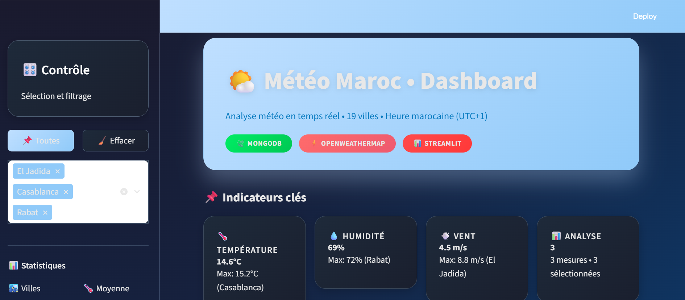
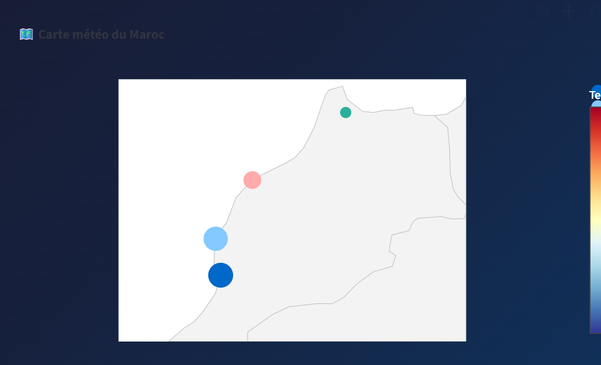
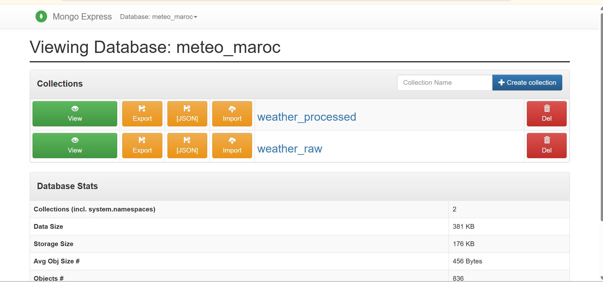
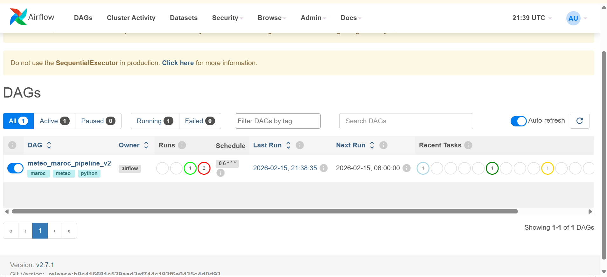
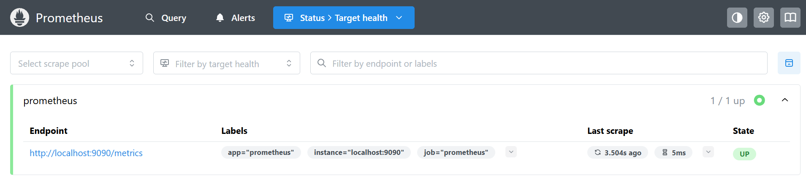
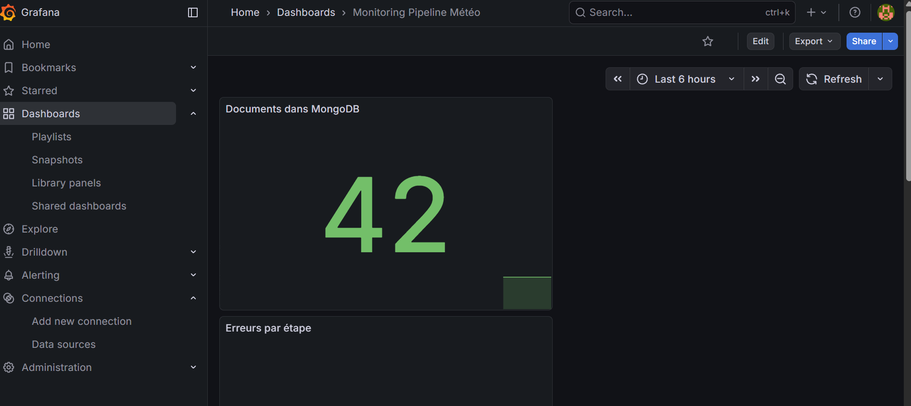
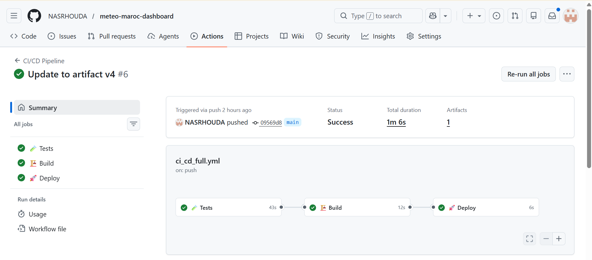

# 🌤️ Météo Maroc - Data Pipeline DevOps

[](https://github.com/NASRHOUDA/meteo-maroc-dashboard/actions/workflows/ci_cd_full.yml)
[](https://python.org)
[](https://mongodb.com)
[](https://streamlit.io)
[](https://docker.com)

---

## 📋 **DESCRIPTION DU PROJET**

Ce projet est un **pipeline Data Engineering complet** qui collecte, transforme et visualise les données météo des **19 principales villes du Maroc** en temps réel via l'API OpenWeatherMap.

### 🎯 **Objectifs**
- Automatiser l'extraction des données météo
- Stocker les données dans MongoDB
- Transformer et enrichir les données (feature engineering)
- Visualiser les données avec un dashboard interactif
- Orchestrer le pipeline avec Airflow
- Monitorer les performances avec Prometheus & Grafana
- Containeriser l'application avec Docker
- Mettre en place l'intégration continue avec GitHub Actions

---

## 🏗️ **ARCHITECTURE**
OpenWeatherMap API → Extraction → MongoDB → Transformation → Dashboard → Monitoring


---

## 🛠️ **TECHNOLOGIES UTILISÉES**

- **Python** : Pandas, Requests, Pymongo
- **Base de données** : MongoDB
- **Visualisation** : Streamlit, Plotly
- **Orchestration** : Apache Airflow
- **Monitoring** : Prometheus, Grafana
- **Containerisation** : Docker, Docker Compose
- **CI/CD** : GitHub Actions

---

## 🚀 **INSTALLATION ET EXÉCUTION**

### **Prérequis**
- Python 3.11+
- Docker & Docker Compose
- Git
- Clé API OpenWeatherMap (gratuite)

### **1. Cloner le dépôt**
```bash
git clone https://github.com/NASRHOUDA/meteo-maroc-dashboard.git
cd meteo-maroc-dashboard
2. Configurer les variables d'environnement
Créez un fichier .env à la racine :

env
OPENWEATHER_API_KEY=votre_clé_api_ici
MONGODB_USER=meteo_user
MONGODB_PASSWORD=meteo_password
MONGODB_DB=meteo_maroc
3. Installation locale
3.1 Environnement virtuel
bash
python -m venv venv
source venv/bin/activate  # Linux/Mac
# ou
venv\Scripts\activate     # Windows
3.2 Dépendances
bash
pip install -r requirements.txt
3.3 Lancer MongoDB
bash
docker run -d --name mongodb -p 27017:27017 -e MONGO_INITDB_ROOT_USERNAME=meteo_user -e MONGO_INITDB_ROOT_PASSWORD=meteo_password mongo:7.0
3.4 Lancer le pipeline
bash
python -m src.pipeline
3.5 Lancer le dashboard
bash
streamlit run dashboards/streamlit_app.py
Accédez à : http://localhost:8501

🐳 AVEC DOCKER COMPOSE
bash
cd docker
docker-compose up -d --build
Services disponibles
Dashboard : http://localhost:8501

MongoDB Express : http://localhost:8081 (admin/admin123)

Airflow : http://localhost:8080 (admin/admin)

Prometheus : http://localhost:9090

Grafana : http://localhost:3000 (admin/admin)

🔄 PIPELINE AUTOMATISÉ
Manuel : python -m src.pipeline

Automatique : via Airflow tous les jours à 6h

📊 MONITORING
Métriques disponibles dans Grafana :

pipeline_runs_total : nombre d'exécutions

extraction_duration_seconds : temps d'extraction

data_points_total : documents dans MongoDB

pipeline_errors_total : erreurs par étape

🧪 TESTS
bash
pytest tests/ -v
🤖 CI/CD
Le pipeline GitHub Actions s'exécute à chaque push :

✅ Tests

✅ Build

✅ Déploiement simulé

🎯 FONCTIONNALITÉS
✅ Extraction des 19 villes du Maroc
✅ Stockage MongoDB
✅ Dashboard interactif avec graphiques et carte
✅ Orchestration Airflow
✅ Monitoring Prometheus/Grafana
✅ Containerisation Docker
✅ CI/CD GitHub Actions
## 📸 **APERÇU DU PROJET**


### Dashboard Principal


### Carte Interactive


### Données MongoDB


### Orchestration Airflow


### Monitoring avec Prometheus


### Monitoring Grafana


### CI/CD avec GitHub Actions


👩‍💻 AUTEUR
NASRHOUDA - Data Engineer / DevOps

[](https://github.com/NASRHOUDA)
